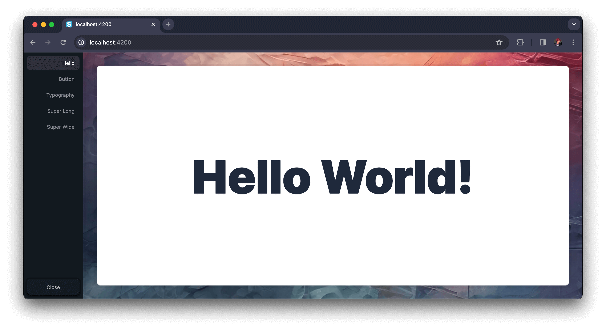

# Storyless

**[👉 LIVE DEMO](https://storyless.vercel.app/)**

Where Your App is the Canvas  
Focus on Features – Not Fluff

For when design system powerhouses like [Storybook](https://storybook.com/) is just too much.

Direct interoperability with your app and main build tools means hard-to-integrate features like authentication, fetching, state management, etc. will just work when you need them.

## 🚀 Getting Started (using Storyless)

Install using your project's package manager:

```
npm i @storyless/react
yarn add @storyless/react
pnpm i @storyless/react
bun i @storyless/react
{the-new-thing} {add-package-command} @storyless/react
```

Then drop it in your app (we're using [Next.js](https://nextjs.org/) as an example here):

```tsx
import { Storyless } from "@storyless/react";

function App({ Component, pageProps }: AppProps) {
  return (
    <>
      <Component {...pageProps} />
      <Storyless
        components={{
          Hello: <h1>Hello World!</h1>,
        }}
      />
    </>
  );
}
```



### 🎭 Combinations

We've added a nifty `<Combinations />` component to help you test your components with different props:

```tsx
import { Storyless, Combinations } from "@storyless/react";

function App({ Component, pageProps }: AppProps) {
  return (
    <>
      <Component {...pageProps} />
      <Storyless
        components={{
          Hello: <h1>Hello World!</h1>,
          // 🗑️ Delete this Button component if copy-pasting
          Button: (
            <Combinations
              component={Button}
              propsToCombine={{
                color: ["#57799F", "#43577E", "#313851", "#D4D195", "#A7C2D1"],
                size: ["lg", "sm"],
                square: [false, true],
                disabled: [false, true],
                children: ["Button"],
              }}
            />
        }}
      />
    </>
  );
}
```


If you want to customize the preview window, you can add a `wrapper` prop to your `<Storyless />` component. Here's a nice starter wrapper using [Tailwind CSS](https://tailwindcss.com/):

```tsx
import { Storyless, Combinations } from "@storyless/react";

function Wrapper({ children }: { children: React.ReactNode }): JSX.Element {
  return (
    <div className="grid h-full w-full place-items-center overflow-auto bg-white p-4 dark:bg-black">
      {children}
    </div>
  );
}

function App({ Component, pageProps }: AppProps) {
  return (
    <>
      <Component {...pageProps} />
      <Storyless
        wrapper={Wrapper}
        components={{
          Hello: <h1>Hello World!</h1>,
          // 🗑️ Delete this Button component if copy-pasting
          Button: (
            <Combinations
              component={Button}
              propsToCombine={{
                color: ["#57799F", "#43577E", "#313851", "#D4D195", "#A7C2D1"],
                size: ["lg", "sm"],
                square: [false, true],
                disabled: [false, true],
                children: ["Button"],
              }}
            />
        }}
      />
    </>
  );
}
```

That's it – now go nuts 🥜🐿️

_And don't worry, it is automatically removed from your production bundle._

## 🚀 Getting Started (for Contributors)

_Note that all installs may require restarting the terminal – and in some cases a complete reboot – to work properly_

Clone this repo to your development environment

Install [node](https://nodejs.org/en/) `>=20.0.0 <21.0.0`\*

> \*Alternatively, you can use [Node Version Manager](https://github.com/nvm-sh/nvm#installing-and-updating) with the included `.nvmrc` file
>
> ```sh
> nvm use
> ```

Install [bun](https://bun.sh/) `>=1.0.12`

Install dependencies:

```sh
bun i
```

Start developing:

```sh
bun dev
```

Unless you're a veteran, it is _highly recommended_ to read through the [**🤯 Problems During Development?**](https://github.com/VidunderGunder/storyless#-problems-during-development) section before starting development.

## What's inside?

This Turborepo includes the following packages & apps:

### Apps and Packages

- 📂 **apps**
  - 📖 **docs** - _Next.js app for Storyless docs._
  - ...A bunch of framework-specific examples
- 📂 **packages**
  - 📚 **react-storyless** - _React (and Next.js) library for Storyless_
  - 📚 **ui** - _Shared UI components for the monorepo_
  - 🧙‍♂️ **tsconfig** - _Reusable TypeScript configurations_
  - 🧙‍♂️ **eslint-config-storyless** - _Reusable ESLint configurations_

## 📦 Publish

_Note: You need to be a member of the `@storyless` npm organization to publish packages_

```bash
npm login
bun publish-packages
```

## Useful TurboRepo Links

Learn more about the power of Turborepo:

- [Tasks](https://turbo.build/repo/docs/core-concepts/monorepos/running-tasks)
- [Caching](https://turbo.build/repo/docs/core-concepts/caching)
- [Remote Caching](https://turbo.build/repo/docs/core-concepts/remote-caching)
- [Filtering](https://turbo.build/repo/docs/core-concepts/monorepos/filtering)
- [Configuration Options](https://turbo.build/repo/docs/reference/configuration)
- [CLI Usage](https://turbo.build/repo/docs/reference/command-line-reference)

## 🤯 Problems During Development?

Below are ways to solve them.

As of now we only support VSCode running on MacOS, Linux and WSL.

You are free to use anything else, but we can't guarantee that it will work.  
Please document your findings if you try something else <3

### Generally

Restart your IDE (VSCode) and/or terminal

Restart your computer

### Permission errors when running commands (MacOS/Linux)

Prefix the command with `sudo`, e.g.:

```bash
sudo whatever you were trying to run
```

### Pulling changes from the repository

Always check for and install new dependecies when you pull changes from the repository:

```bash
bun i
```

### Wrong version of Node

- Check your version with
  ```bash
  node -v
  ```
- Install the correct version according to `engines` in `package.json`

### Wrong version of bun

Check your version with

```bash
bun -v
```

Install the correct version according to `engines` in `package.json`

### Using 32-bit version of Node (Windows)

Getting `error Command failed with exit code 3221225477` or something similar?

Check if you're using 32-bit Node.js:

```bash
node -p "process.arch"
```

If so, ensure you're running on a 64-bit system, then install the 64-bit version instead.

### Divergent git branches

```bash
git config pull.rebase false
```

### Ports already in use

Kill the processes running on relevant ports:

```bash
bun run killports
```

### Weird TypeScript or ESLint errors

First, make sure you're running the workspace version of TypeScript and ESLint:

Open up any TypeScript file in the project and press...

<ul>
  <li>
    <kbd>⌘</kbd> + <kbd>Shift</kbd> + <kbd>P</kbd> on Mac  
  </li>
  <li>
    <kbd>Ctrl</kbd> + <kbd>Shift</kbd> + <kbd>P</kbd> on Windows
  </li>
</ul>

Then ask VSCode to use the workspace TypeScript version:

```
> TypeScript: Select TypeScript Version
```

Then restart the TypeScript server:

```
> TypeScript: Restart TS server
```

Same for ESLint:

```
> ESLint: Restart ESLint server
```
