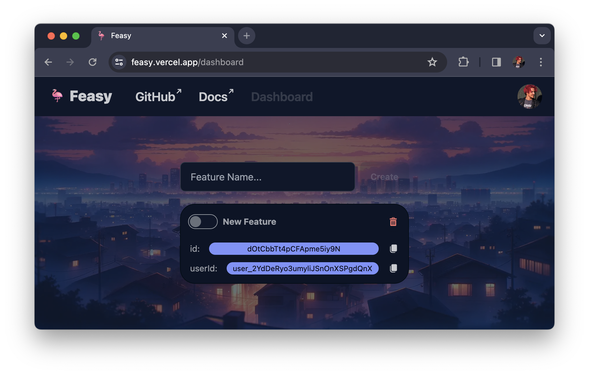
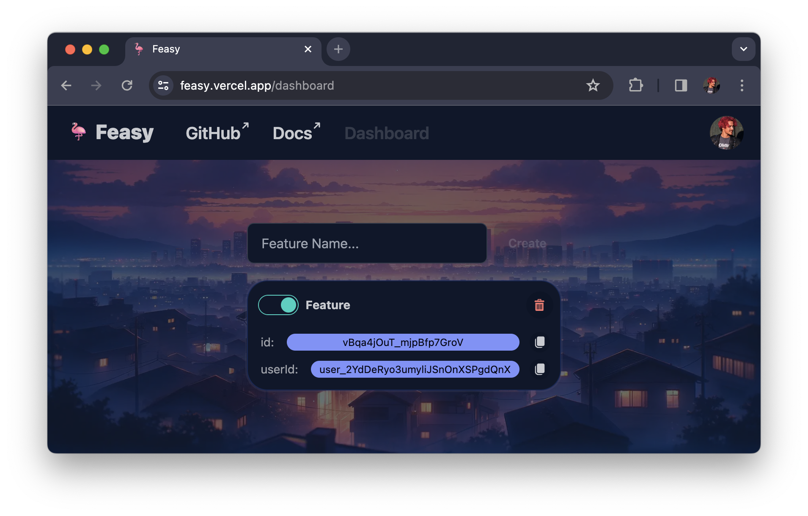
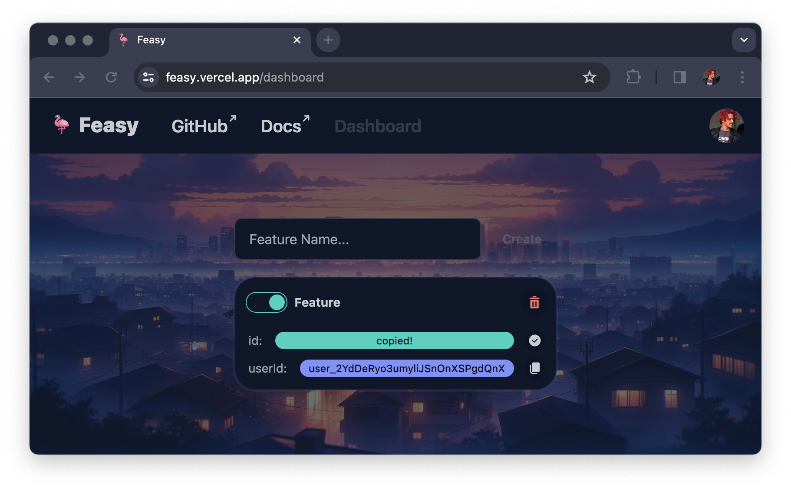

# 🦩 Feasy - Feature Toggle Service

[Feasy](https://feasy.vercel.app/) is a super simple service designed for agile and dynamic software development teams. It simplifies the process of rolling out new features and safely phasing out old ones.

With Feasy, feature toggles are heckin' easy.

## 🚀 Getting Started

Feasy is two things:

1. A dashboard for managing feature toggles
2. A REST API for fetching feature toggles

### 🖥️ Using the Dashboard

Make sure you're signed in, then navigate to the [Feasy Dashboard](https://feasy.vercel.app/dashboard).

Here you create your new feature toggle by writing a name for it and clicking the "Create" button.


Voila!



You can toggle the feature on and off by clicking the toggle button.



Copy the ID of the feature toggle by clicking the copy button, we'll need this later.



### 📲 Using Feasy in your Application (JS)

Feasy is a REST API, so you can use it in any application that can make HTTP requests.

To fetch the status of a feature toggle, make a GET request to `https://feasy.vercel.app/api/toggle`, with the ID of the feature toggle as a query parameter.

For example, if the ID of your feature toggle is `123`, you would make a GET request to `https://feasy.vercel.app/api/toggle?id=123`.

Alternatively, you can pass a `userId` or `ordId` as a query parameter, and Feasy will return the status of all feature toggles that apply to that user or organization.

The response will be an array of JSON objects with your to toggles:

```json
[
  {
    "id": "somefeaturetoggle",
    "name": "My Feature Toggle",
    "enabled": "true",
    "userId": "user_2YiJSnQnXdDePgdyo3umyl",
    "orgId": null,
    "createdAt": "2023-11-25T12:36:48.000Z",
    "updatedAt": "2023-11-25T12:37:09.000Z"
  }
]
```

#### Using fetch

```ts
// Replace these with your own IDs
const toggleId = "somefeaturetoggle";
const userId = "user_2YiJSnQnXdDePgdyo3umyl";
const orgId = "org_2YiJSnQnXdDePgdyo3umyl";

// fetch toggles by toggle ID
fetch("/api/toggle?id=" + toggleId)
  .then((response) => response.json())
  .then((data) => {
    console.log("Single Toggle:", data);
  })
  .catch((error) => console.error("Error fetching toggle by ID:", error));

// fetch toggles by user ID
fetch("/api/toggle?userId=" + userId)
  .then((response) => response.json())
  .then((data) => {
    console.log("User Toggles:", data);
  })
  .catch((error) => console.error("Error fetching toggles by user ID:", error));

// fetch toggles by org ID
fetch("/api/toggle?orgId=" + orgId)
  .then((response) => response.json())
  .then((data) => {
    console.log("Organization Toggles:", data);
  })
  .catch((error) => console.error("Error fetching toggles by org ID:", error));
```

#### Tanstack Query (React Query)

Define your fetch functions:

```ts
const fetchToggleById = async (id: string): Promise<ResponseData> => {
  const response = await fetch(`/api/toggle?id=${id}`);
  if (!response.ok) throw new Error("Network response was not ok");
  return response.json();
};

const fetchTogglesByUserId = async (userId: string): Promise<ResponseData> => {
  const response = await fetch(`/api/toggle?userId=${userId}`);
  if (!response.ok) throw new Error("Network response was not ok");
  return response.json();
};

const fetchTogglesByOrgId = async (orgId: string): Promise<ResponseData> => {
  const response = await fetch(`/api/toggle?orgId=${orgId}`);
  if (!response.ok) throw new Error("Network response was not ok");
  return response.json();
};
```

Then use them in your components:

```ts
const SingleToggle = ({ id }: { id: string }) => {
  const { data, error, isLoading } = useQuery(['toggle', id], () => fetchToggleById(id));

  if (isLoading) return <div>Loading...</div>;
  if (error) return <div>An error occurred: {error.message}</div>;

  return <pre>Toggle: {JSON.stringify(data, null, 2)}</pre>;
};

const UserToggles = ({ userId }: { userId: string }) => {
  const { data, error, isLoading } = useQuery(['userToggles', userId], () => fetchTogglesByUserId(userId));

  if (isLoading) return <div>Loading...</div>;
  if (error) return <div>An error occurred: {error.message}</div>;

  return <pre>User Toggles: {JSON.stringify(data, null, 2)}</pre>;
};

const OrgToggles = ({ orgId }: { orgId: string }) => {
  const { data, error, isLoading } = useQuery(['orgToggles', orgId], () => fetchTogglesByOrgId(orgId));

  if (isLoading) return <div>Loading...</div>;
  if (error) return <div>An error occurred: {error.message}</div>;

  return <pre>Organization Toggles: {JSON.stringify(data, null, 2)}</pre>;
};

```

## Contributing

We welcome contributions to Feasy! Just create an issue or create a pull request and we'll have a look.
