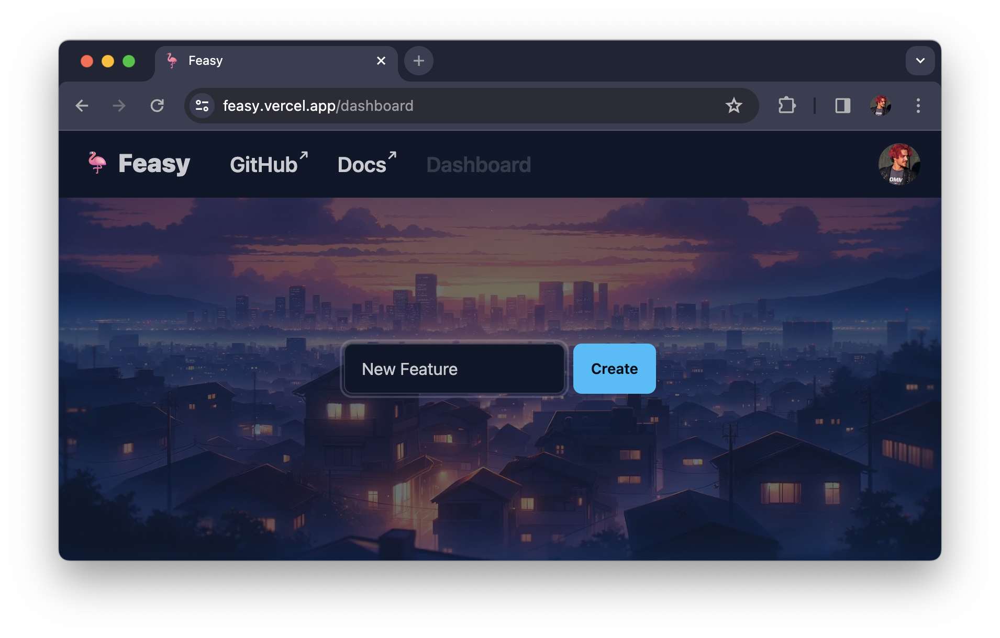

# 🦩 Feasy - Feature Toggle Service

Feasy is a cutting-edge feature toggle service designed for agile and dynamic software development teams. It simplifies the process of rolling out new features and safely phasing out old ones.

With Feasy, feature toggles are heckin' easy.

## 🚀 Getting Started

Make sure you're signed in, then navigate to the [Feasy Dashboard](https://feasy.vercel.app/dashboard).

Here you create your new feature toggle.

## Contributing

We welcome contributions to Feasy! Just create an issue or create a pull request and we'll have a look.
