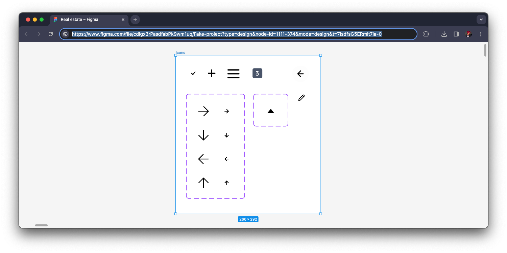
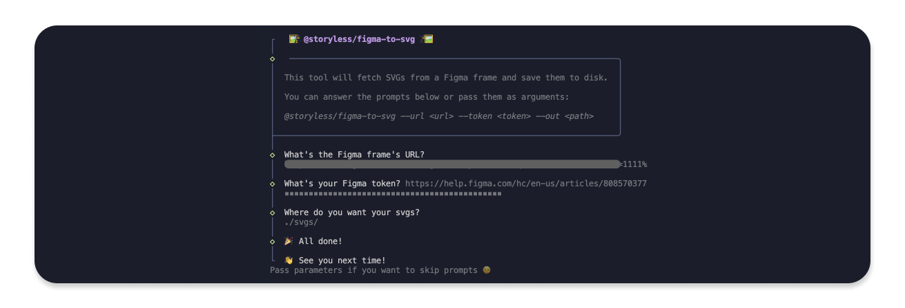

# 🥷 Figma to SVG

Figma to SVG is a CLI tool that allows you to download SVGs from a specific frame in Figma

_it probably works for entire files too, but that's not our use case – so feel free to try it out and let us know!_

## 📋 You'll need

1. A Figma API token (see the guide [here](https://www.figma.com/developers/api#access-tokens))
2. A Figma file URL (you can get one by opening a file in Figma, selecting a frame and copying the URL)
3. Optionally, a path to save the SVGs to (defaults to `./svgs/`)

## 🚀 Usage

Prepare your icons and copy the frame's URL:



Then, run the CLI:

```bash
npx @storyless/figma-to-svg # npm
yarn dlx @storyless/figma-to-svg # yarn
pnpx @storyless/figma-to-svg # pnpm
bunx @storyless/figma-to-svg # bun
```



You can also pass parameters to the CLI, to skip the prompts:

```bash
bunx @storyless/figma-to-svg --url "https://www.figma.com/file/yourfileidhere/Project-Name?node-id=69%3A420&mode=dev" --token "figd_23eredgfEegdf-0910g2ojsDjjek-kPbbzmmo6twXG4" --out "./some/folder/"
```

> [!NOTE]  
> The example uses `bunx`, but you can also use `npx`, `yarn dlx`, `pnpx` or any other package runner.

> [!TIP]  
> If the command fails, try specifying the exact version of the package, e.g. `bunx @storyless/figma-to-svg@x.x.x`
>
> Find the latest version [here](https://www.npmjs.com/package/@storyless/figma-to-svg?activeTab=versions)

## ⚛️ SVGR

If you want to turn these into React components, you can use [SVGR](https://react-svgr.com/).

Here's an example command to get you started:

```bash
bunx @svgr/cli --replace-attr-values=#000=currentColor --svgo-config=./svgo.config.cjs --out-dir svgr --ext tsx --typescript -- svgs
```

Add this `svgo.config.cjs` to your root (or where you run the svgr command from) as well to have some ok defaults:

```js
module.exports = {
  plugins: [
    {
      name: "preset-default",
      params: {
        overrides: {
          // disable a default plugin
          removeViewBox: false,

          // customize the params of a default plugin
          inlineStyles: {
            onlyMatchedOnce: false,
          },
        },
      },
    },
  ],
};
```

- [Options for SVGR](https://react-svgr.com/docs/options/)
- [More info on SVGO](https://github.com/svg/svgo/blob/main/README.md)
