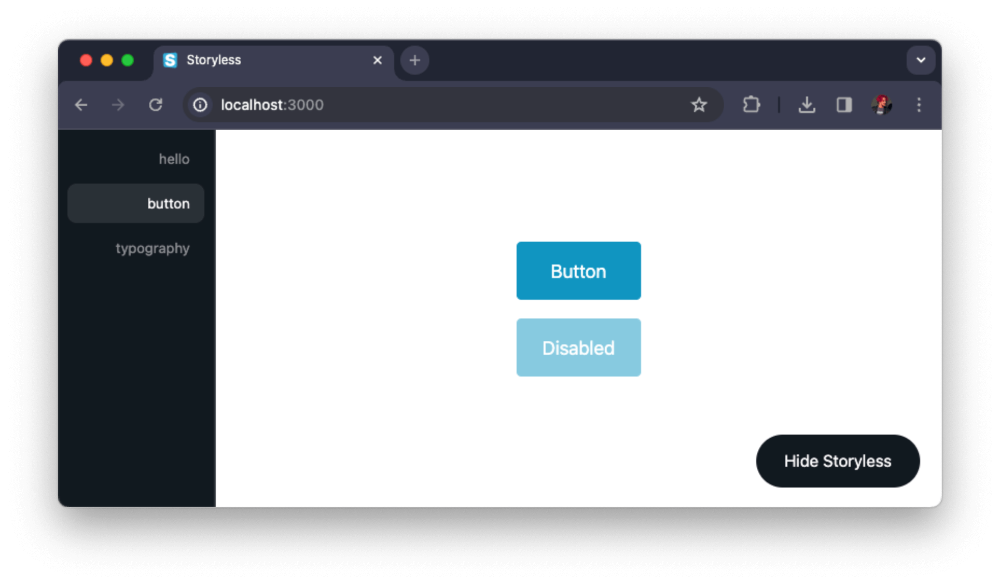

# Storyless

Where Your App is the Canvas  
Focus on Features – Not Fluff

For when design system powerhouses like [Storybook](https://storybook.com/) is just too much.

Direct interoperability with your app and main build tools means hard-to-integrate features like authentication, fetching, state management, etc. will just work when you need them.

Drop it in your app and start developing. It is automatically removed from your production bundle.

## [👉 DEMO](https://storyless.vercel.app/)



## 🚀 Getting Started

Pick your package manager of choice:

```
npm i @storyless/react
yarn add @storyless/react
pnpm i @storyless/react
bun i @storyless/react
{the-new-thing} {add-package-command} @storyless/react
```
