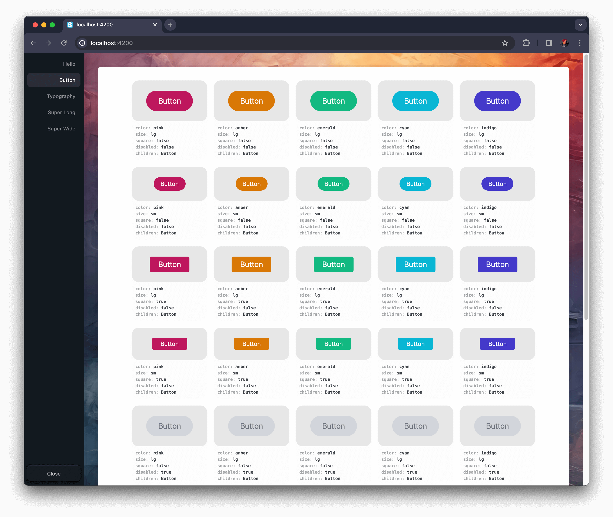

# Storyless

**[👉 LIVE DEMO](https://storyless.vercel.app/)**

Where Your App is the Canvas  
Focus on Features – Not Fluff

For when design system powerhouses like [Storybook](https://storybook.com/) is just too much.

Direct interoperability with your app and main build tools means hard-to-integrate features like authentication, fetching, state management, etc. will just work when you need them.

## 🚀 Getting Started

Install using your project's package manager:

```
npm i @storyless/react
yarn add @storyless/react
pnpm i @storyless/react
bun i @storyless/react
{the-new-thing} {add-package-command} @storyless/react
```

Then drop it in your app (we're using [Next.js](https://nextjs.org/) as an example here):

```tsx
import { Storyless } from "@storyless/react";

function App({ Component, pageProps }: AppProps) {
  return (
    <>
      <Component {...pageProps} />
      <Storyless
        components={{
          Hello: <h1>Hello World!</h1>,
        }}
      />
    </>
  );
}
```


### 🎭 Combinations

We've added a nifty `<Combinations />` component to help you test your components with different props:

```tsx
import { Storyless, Combinations } from "@storyless/react";

function App({ Component, pageProps }: AppProps) {
  return (
    <>
      <Component {...pageProps} />
      <Storyless
        components={{
          Hello: <h1>Hello World!</h1>,
          // 🗑️ Delete this Button component if copy-pasting
          Button: (
            <Combinations
              component={Button}
              propsToCombine={{
                color: ["#57799F", "#43577E", "#313851", "#D4D195", "#A7C2D1"],
                size: ["lg", "sm"],
                square: [false, true],
                disabled: [false, true],
                children: ["Button"],
              }}
            />
        }}
      />
    </>
  );
}
```



If you want to customize the preview window, you can add a `wrapper` prop to your `<Storyless />` component. Here's a nice starter wrapper using [Tailwind CSS](https://tailwindcss.com/):

```tsx
import { Storyless, Combinations } from "@storyless/react";

function Wrapper({ children }: { children: React.ReactNode }): JSX.Element {
  return (
    <div className="grid h-full w-full place-items-center overflow-auto bg-white p-4 dark:bg-black">
      {children}
    </div>
  );
}

function App({ Component, pageProps }: AppProps) {
  return (
    <>
      <Component {...pageProps} />
      <Storyless
        wrapper={Wrapper}
        components={{
          Hello: <h1>Hello World!</h1>,
          // 🗑️ Delete this Button component if copy-pasting
          Button: (
            <Combinations
              component={Button}
              propsToCombine={{
                color: ["#57799F", "#43577E", "#313851", "#D4D195", "#A7C2D1"],
                size: ["lg", "sm"],
                square: [false, true],
                disabled: [false, true],
                children: ["Button"],
              }}
            />
        }}
      />
    </>
  );
}
```

That's it – now go nuts 🥜🐿️

_And don't worry, Storyless is automatically removed from your production bundle._
